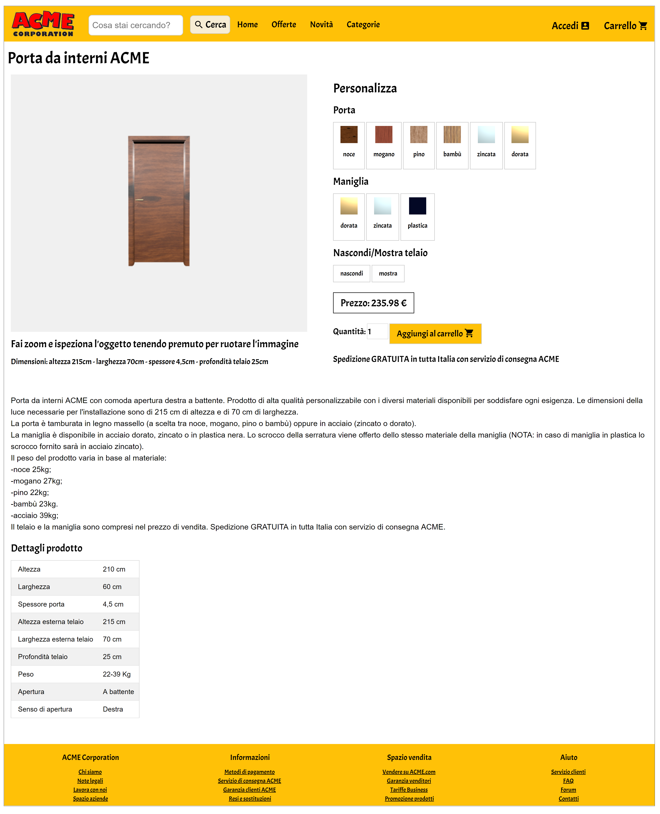
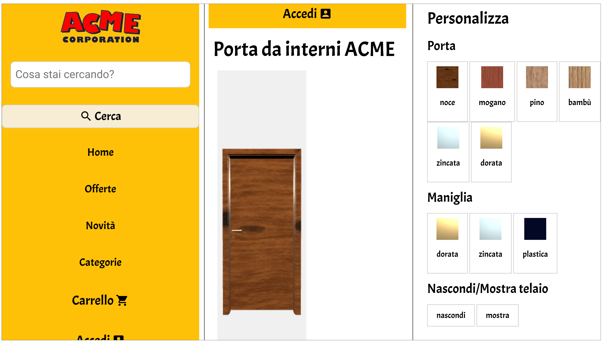

# Product Configuration

Progetto per il corso di Interactive 3D Graphics dell'Università di Udine (2019).

La consegna prevede la progettazione e creazione di un visualizzatore/configuratore web per un sito di e-commerce della famosa ACME Corporation, azienda immaginaria di film e serie animate che produce e vende qualsiasi cosa. L'obbiettivo è creare un'applicazione web (pagina HTML) utilizzando three.js con materiali ed equazioni PBR che consenta di visualizzare fedelmente un prodotto qualunque e che permetta agli utenti di ispezionare l'oggetto cambiando anche i materiali tra diverse alternative proposte. Alla fine si dovrà ottenere una semplice ma realistica porzione di un sito di e-commerce, pertanto va posta attenzione anche allo stile con colori, font, immagini e icone adeguate magari ispirate a siti web reali.

## Descrizione

 

 Il risultato finale di questo progetto è una rappresentazione di un'ipotetica pagina web del sito di e-commerce della ACME Corporation nella quale viene esposto un prodotto in vendita. Il prodotto in questione è una porta da interni, disponibile in diversi materiali. L'oggetto viene visualizzato tramite un modello 3d che può essere personalizzato dall'utente tramite gli appositi pulsanti: un potenziale cliente è in grado quindi di capire come si presenterebbe la porta scegliendo tra le varie opzioni a disposizione.

## File e cartelle

* **`lib`**: contiene le librerie necessarie al funzionamento del progetto.
* **`model`**: contiene il file del modello 3d della porta.
  * `Door_Component_BI3.obj`: modello 3d della porta realizzato da [3dhaupt](https://free3d.com/it/user/3dhaupt), trovato su [free3d.com](https://free3d.com/it/3d-model/room-door-94798.html).
* **`pics`**: contiene le immagini inserite in questo file, nel `journal.md` e alcune di quelle utilizzate nella pagina web.
* **`scripts`**: contiene i file Javascript per la visualizzazione del prodotto e la gestione della pagina web.
  * `getMaterials.js`: file che contiene le funzioni per la gestione dei materiali.
  * `lightsSetup.js`: file che contiene il setup delle luci.
  * `main.js`: file che contiene le funzioni principali per il caricamento e la visualizzazione della porta.
  * `materialMetal.js`: file che contiene le funzioni per la generazione di materiali metallici.
  * `materialTexture.js`: file che contiene le funzioni per la generazione di materiali da texture.
  * `priceCalculator.js`: file che contiene le funzioni per il calcolo dinamico del prezzo del prodotto.
* **`textures`**: contiene le textures dei materiali di porta e maniglia.
  * `bamboo[_col|_rgh|_spc].jpg`: componente diffusiva, di roughness e speculare della texture del bambù (da [freepbr.com](https://freepbr.com/materials/bamboo-wood-pbr-material/)).
  * `Mahogany[_col|_rgh|_spc].jpg`: componente diffusiva, di roughness e speculare della texture del mogano (da [3dtextures.me](https://3dtextures.me/2018/12/27/wood-009-mahogany/)).
  * `Plastic[_col|_rgh|_spc].jpg`: componente diffusiva, di roughness e speculare della texture della plastica (da [3dtextures.me](https://3dtextures.me/2018/03/26/plastic-001-w-speckles-and-fingerprints/)).
  * `Wood_011[_col|_rgh|_spc].jpg`: componente diffusiva, di roughness e speculare della texture del pino (da [3dtextures.me](https://3dtextures.me/2019/01/10/wood-011a/)).
  * `Wood29[_col|_rgh|_spc].jpg`: componente diffusiva, di roughness e speculare della texture del noce (da [cc0textures.com](https://www.cc0textures.com/view.php?tex=Wood29)).
* `index.html`: file principale che contiene il codice della pagina web e gli shader.
* `journal.md`: file che contiene il processo di sviluppo del progetto: qui vengono segnalati i progressi giornalieri e le scelte effettuate.
* `README.md`: questo file.

## Risultati

Il progetto è stato sviluppato creando una pagina web ispirata ai siti di e-commerce generici che propongono qualsiasi tipo di prodotto ([Amazon](https://www.amazon.it/), [eBay](https://www.ebay.it/)) in quanto la ACME Corporation vende di tutto. Per la realizzazione della pagina si è deciso di sfruttare il framework [W3.CSS](https://www.w3schools.com/w3css/). Il font principale è Acme (sembrava proprio adatto) di [Huerta Tipográfica](https://huertatipografica.com/en), caricato tramite [Google Fonts](https://fonts.google.com/specimen/Acme) così come le icone. Per la visualizzazione del prodotto sono stati utilizzati due tipi di vertex e fragment shader: uno per la realizzazione dei materiali di acciaio e uno per la gestione delle texture di legno e plastica. Tutti e quattro sono stati presi (e opportunamente modificati) da esempi visti durante il corso, pertanto le equazioni di rendering sono quelle studiate a lezione. Per i metalli e le texture è stato usato il codice degli shader proposti a lezione, opportunamente adattati per gestire la situazione che si presentava in questo progetto. Come richiesto dalla consegna, la pagina presenta una zona in cui il cliente può personalizzare il prodotto modificando i materiali di porta e maniglia, osservando quindi l'effetto visivo sul modello (*qui sotto: porta in acciaio zincato con maniglia in plastica*).

Il prezzo presentato cambia dinamicamente in base alla combinazione che si sta visualizzando (*qui sotto: porta in mogano con maniglia in acciaio zincato*).

Si è deciso anche di inserire la possibilità di nascondere il telaio per mostrare solo la porta e permettere di vedere lo scrocco. L'utente ha la possibilità di ruotare e zoomare sul prodotto per esaminarlo meglio in tutti i suoi dettagli (*qui sotto: porta in bambù con maniglia in acciaio dorato e telaio nascosto per mostrare lo scrocco*).

La pagina è stata progettata in modo da potersi adattare anche agli schermi degli smartphone, sfruttando soprattutto gli strumenti di W3.CSS che consentono di creare un design responsivo. Sfruttando la forma vertiacale della porta, si è deciso di lasciare spazio a destra dell'oggetto per rendere più comodo lo scorrimento della pagina usando le dita (*qui sotto: alcune schermate della pagina visualizzata su uno smartphone*).

Il progetto è stato sviluppato con un notebook ASUS VivoBook Pro 15 N580VD-FI523T con le seguenti caratteristiche:
- processore Intel Core i7-7700hq (2.8 ghz)
- GPU NVIDIA GeForce GTX 1050
- sistema operativo Windows 10 Home
- browser Google Chrome versione 75.0.3770.100 (Build ufficiale) (a 64 bit)

In tutte le prove effettuate con questo laptop il frame rate è stato sempre di 60 fps. La pagina è stata testata anche in pc con caratteristiche molto inferiori ma il frame rate è sempre rimasto invariato. I 60 fps sono sempre stati raggiunti anche nei test su smartphone di fascia medio-alta (Samsung Galaxy S7 edge e Huawei P smart) mentre con un dispositivo mobile più datato e di fascia bassa (LG Spirit H420) il frame rate è rimasto tra i 20 e i 30 fps.

## Processo di sviluppo

La prima fase è stata dedicata alla progettazione del layout della pagina web su carta.

|  |
| :---------------------------------------------: |
| Progetto della pagina web |

Successivamente la pagina di prova è stata implementata utilizzando come prodotto mock un semplice cubo 3d.

|  |
| :-------------------------------------: |
| Realizzazione della pagina web di prova (logo ACME da [warnerbros.fandom.com](https://warnerbros.fandom.com/wiki/ACME_Corporation?file=Acme-corp.png)) |

In seguito l'attenzione è stata rivolta al prodotto da visualizzare: la porta è sembrata una buona idea in quanto poteva essere fatta sia in leghe metalliche sia di legno (materiale per cui erano disponibili molte texture libere). Il lavoro è proseguito quindi in parallelo tra il miglioramento della pagina web, l'organizzazione del codice e le prove di visualizzazione della porta. Per quanto riguarda i materiali, la decisione finale è stata quella di permettere all'utente di scegliere tra due varietà di acciaio (dorato e zincato) e quattro legni diversi (noce, mogano, pino e bambù) per la porta e tra acciaio (sempre dorato o zincato) e plastica per la maniglia.

|  |
| :----------------------------: |
| Le texture utilizzate nel progetto. Da sinistra a destra: [noce](https://www.cc0textures.com/view.php?tex=Wood29), [mogano](https://3dtextures.me/2018/12/27/wood-009-mahogany/), [pino](https://3dtextures.me/2019/01/10/wood-011a/), [bambù](https://freepbr.com/materials/bamboo-wood-pbr-material/) e [plastica](https://3dtextures.me/2018/03/26/plastic-001-w-speckles-and-fingerprints/)|

### Strumenti e risorse

* **Atom**: editor per il coding e la gestione della repository.
* **W3.CSS**: framework utilizzato per la creazione della pagina web.
* **Microsoft Paint**: utilizzato per alcune semplici modifiche a texture e altre immagini.
* **iLoveIMG**: app online utilizzata per ridimensionare e ruotare alcune immagini e texture.

## Difetti noti

* Per permettere al contenitore in cui è visualizzato il prodotto di adattarsi alle dimensioni della pagina, è stata aggiunta una funzione che la ricarica ad ogni ridimensionamento all'interno della *mainFunction*. Questa però causa nei dispositivi mobili dei fastidiosi refresh automatici durante lo scorrimento. Per ovviare al problema è stata aggiunta una guardia che blocca la funzione negli smartphone, ma nei tablet il difetto rimane.