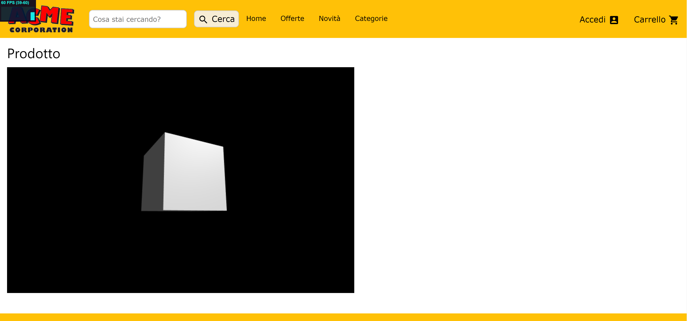

# 27 giugno 2019

* Lettura e comprensione della consegna.
* Studio e ricerche su HTML e CSS per poter creare la pagina web in cui inserire il prodotto.
* Creazione del file `journal.md`.

# 28 giugno 2019

* Ancora studio e ricerche su HTML e CSS per poter creare la pagina web in cui inserire il prodotto.
* Prove di creazione di vari elementi di pagine web che potrebbero tornare utili.
* Aggiornamento journal.

# 29 giugno 2019

* Ancora studio e ricerche su HTML e CSS per poter creare la pagina web in cui inserire il prodotto.
* Ricerca online di possibili modelli 3D di oggetti da inserire nel progetto.
* Alcune prove di rendering di un modello di vaso da fiori.
* ACME vende qualsiasi cosa, quindi i siti web di riferimento per la creazione della pagina saranno i generici siti di e-commerce in cui è possibile comprare di tutto ([Amazon](https://www.amazon.it/), [eBay](https://www.ebay.it/)).
* Progettazione su carta della pagina web.

|  |
| :---------------------------------------------: |
| Progetto della pagina web |

* Aggiornamento journal.

# 30 giugno 2019

* Prove di realizzazione della pagina web di prova (logo ACME da [warnerbros.fandom.com](https://warnerbros.fandom.com/wiki/ACME_Corporation?file=Acme-corp.png)).

|  |
| :-------------------------------------: |
| Realizzazione della pagina web di prova |

* Test di visualizzazione della pagina di prova da dispositivi mobili.

|  |
| :---------------------------------------------------: |
| Visualizzazione della pagina web di prova da dispositivo mobile |

* Il vaso non convince come prodotto da visualizzare, ricerca di altri oggetti.
* Trovato il modello di una porta (da [free3d.com](https://free3d.com/it/3d-model/room-door-94798.html), modello realizzato da [3dhaupt](https://free3d.com/it/user/3dhaupt)).
* Varie prove sul modello della porta.
* Aggiornamento journal.

# 1 luglio 2019

* Creazione della repository del progetto.
* Varie prove di materiali e texture sul modello della porta utilizzando gli shader visti a lezione.
* Aggiornamento journal.

# 2 luglio 2019

* Lavori sui font della pagina web.
* Prove di rendering del modello nella pagina web.
* Varie prove di posizionamento delle luci.
* Sistemazione elementi pagina web.
* Aggiornamento journal.

# 3 luglio 2019

* Prove di visualizzazione del modello nella pagina web con cambio di materiali e mostra/nascondi telaio.
* Creazione del file `main.js` e scrittura del codice della funzione principale (*mainFunction*) per il caricamento del modello nella pagina web.
* Scrittura del codice di prova per la creazione e modifica dei materiali.
* Scrittura del codice del setup delle luci (file `lightSetup.js`) dopo alcune ricerche online e i consigli di una persona esperta.
* Varie prove di sistemazione layout della pagina web.
* Aggiornamento journal.

# 4 luglio 2019

* Creazione dei pulsanti per cambio materiali maniglia e porta (con materiali di prova).
* Creazione funzioni per il cambio dei materiali.
* Ricerca delle texture.
* Trovate texture di legno ([noce](https://www.cc0textures.com/view.php?tex=Wood29) da [cc0textures.com](https://www.cc0textures.com/) e [mogano](https://3dtextures.me/2018/12/27/wood-009-mahogany/) da [3dtextures.me](https://3dtextures.me/)).

|  |
| :--------------------------------------: |
| Texture di [noce](https://www.cc0textures.com/view.php?tex=Wood29) (sinistra) e [mogano](https://3dtextures.me/2018/12/27/wood-009-mahogany/) (destra) |

* Varie prove con le texture trovate.
* Modifiche ai pulsanti e al layout della pagina web.
* Aggiornamento journal.

# 5 luglio 2019

* Creazione funzione per la modifica dinamica del prezzo in base ai materiali scelti (*calcPrice* nel file `priceCalculator.js`).
* Completate alcune parti della pagina web.
* Ricerca di altre texture di legno e di plastica per porta e maniglia.
* Trovate [pino](https://3dtextures.me/2019/01/10/wood-011a/) (da [3dtextures.me](https://3dtextures.me/)), [bambù](https://freepbr.com/materials/bamboo-wood-pbr-material/) (da [freepbr.com](https://freepbr.com/)) e [plastica](https://3dtextures.me/2018/03/26/plastic-001-w-speckles-and-fingerprints/) (ancora da [3dtextures.me](https://3dtextures.me/)).

|  |
| :-----------------------------------------------: |
| Texture di [pino](https://3dtextures.me/2019/01/10/wood-011a/) (sinistra), [bambù](https://freepbr.com/materials/bamboo-wood-pbr-material/) (centro) e [plastica](https://3dtextures.me/2018/03/26/plastic-001-w-speckles-and-fingerprints/) (destra) |

* Inserimento delle nuove texture nella pagina.
* La texture della plastica è fatta per risultare sporca e coperta da impronte, ma nella maniglia non si nota quindi può andare bene.
* Aggiornamento journal.

# 6 luglio 2019

* Sistemate icone materiali.
* Trovata soluzione al fastidioso difetto dei refresh automatici da dispositivo mobile dovuti alla funzione per la gestione dei resize della pagina: funzione bloccata nei dispositivi a schermo piccolo in quanto risultava inutile e dannosa.
* Il problema tuttavia persiste nei tablet. Non trovata una soluzione completa e soddisfacente.
* Sistemati vari difetti estetici della pagina web.
* Sostituito l'alluminio (non adatto a porte da interni) con lo zinco.
* Sistemati prezzi e caratteristiche prodotto.
* Revisione codice.
* Aggiornamento journal.

# 7 luglio 2019

* Sistemate cartelle e eliminati file inutili.
* Redazione README.
* Aggiornamento journal.

# 8 luglio 2019

* Revisione README.
* Revisione codice.
* Progetto concluso.
* Aggiornamento journal.
